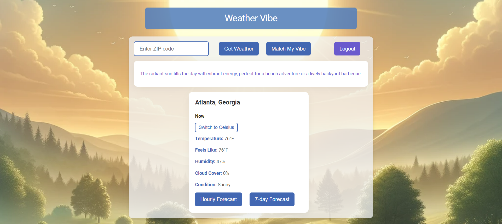

# WeatherVibe App

## Welcome to WeatherVibe!

WeatherVibe is a delightful and intuitive weather application designed to not only provide you with up-to-the-minute weather updates but also to match your day's vibe with the current weather conditions. Whether it's a sunny day perfect for a picnic or a cozy rainy evening ideal for reading, WeatherVibe has suggestions for you.

Built with modern technologies, including Vue.js for a dynamic and responsive user interface, Node.js and Express.js for robust server-side operations, and MongoDB for efficient data storage, WeatherVibe is crafted to offer an engaging user experience.

### Key Features:

- **Real-Time Weather Updates:** Get accurate and current weather information for your location.
- **Match My Vibe:** Unique feature that suggests activities based on the current weather conditions.
- **User Accounts:** Easy sign-up and sign-in process to personalize your experience.
- **Responsive Design:** Whether you're on a phone, tablet, or desktop, WeatherVibe looks great on any device.

### Getting Started:

Follow these simple steps to get WeatherVibe running on your local machine:

#### 1. Clone the Repository:
- Open your terminal.
- Navigate to the directory where you want to clone the project.
- Run `git clone <repository-url>`. Replace `<repository-url>` with the actual URL of the WeatherVibe repository.

#### 2. Set Up the Backend:
- Navigate to the backend directory: `cd backend`
- Install dependencies: `npm install`
- Make sure you have MongoDB running on your machine. If not, install and start MongoDB.
- Create a `.env` file in the backend root directory and add your database connection string and other environment variables as needed.
- Start the server: `node server.js`

#### 3. Set Up the Frontend:
- Open a new terminal tab or window.
- Navigate to the frontend directory: `cd frontend`
- Install dependencies: `npm install`
- Start the Vue.js application: `npm run dev`
- Your default web browser should open automatically with the WeatherVibe app running.

#### 4. Sign Up/Sign In:
- Use the sign-up page to create a new user account.
- If you already have an account, click on the sign-in page to access your personalized WeatherVibe dashboard.

#### 5. Enjoy WeatherVibe:
- Explore the app, check the weather, and get personalized activity suggestions with the "Match My Vibe" feature.
